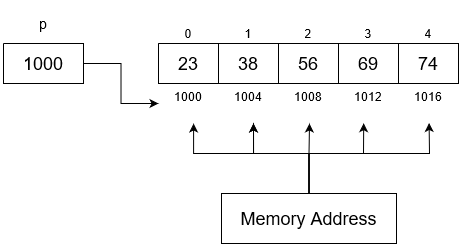

# 04 – Arrays and Character Arrays (C++)

## 🎯 Célok

- Megérteni a tömbök (arrays) működését és használatát.
- Megtanulni, hogyan kell kezelni egydimenziós és kétdimenziós tömböket.
- Megérteni a C-stringek (char[]) működését.
- Gyakorlati példákon keresztül gyakorolni a keresést, rendezést és szövegfeldolgozást.

---

## 1. Tömbök alapjai

Egy tömb azonos típusú elemek sorozata, amelyet indexeléssel érünk el.

**Létrehozás:**
```cpp
int numbers[5];              // 5 elemű egész tömb
int values[3] = {10, 20, 30}; // inicializálás
int data[] = {1, 2, 3, 4};    // méret automatikusan 4
```

**Indexelés:**
- Az első elem indexe mindig 0.
- Utolsó elem indexe: méret-1.

```cpp
cout << values[0]; // 10
values[2] = 99;    // harmadik elem átírása
```

> ⚠️ Ha túlindexelsz (pl. `values[5]`), az hibás működéshez vezethet.

👉 **01 - Feladat közösen:** Hozz létre egy 5 elemű tömböt, töltsd fel számokkal, majd írd ki az első és utolsó elemét!  
👉 **02 - Feladat önállóan:** Hozz létre egy 10 elemű tömböt, és számold ki az elemek átlagát!

---

## 2. Tömb bejárása ciklussal

```cpp
int arr[5] = {3, 7, 2, 8, 5};

const int n = sizeof(arr) / sizeof(arr[0]); // tömb méretének meghatározása, pl ha int 4 byte -> sizeof(arr) = 4 * 5, sizeof(arr[0]) -> 4
// ekvivalens: const int n = 5;

// Hagyományos for ciklus
for (int i = 0; i < 5; i++) {
    cout << arr[i] << " ";
}
cout << endl;

// Range-based for ciklus (C++11-től)
for (int x : arr) {
    cout << x << " ";
}
cout << endl;
```

👉 **03 - Feladat közösen:** Írj programot, ami kiírja egy tömb minden elemét for ciklussal!  
👉 **04 - Feladat önállóan:** Írj programot, ami megszámolja, hány páratlan szám van a tömbben!

---

## 3. Tömb átadása függvénynek

Egy tömböt nem másolatként, hanem hivatkozásként (referenciaként) kap meg a függvény — vagyis a függvény ugyanazt a memóriaterületet használja, mint a hívó kód. Ha tehát a függvény módosítja a tömb elemeit, azok a függvényen kívül is megváltoznak.

```cpp
void printArray(int arr[], int size) {
    for (int i = 0; i < size; i++) {
        cout << arr[i] << " ";
    }
}

int main() {
    int nums[3] = {1, 2, 3};
    const int n = sizeof(nums) / sizeof(nums[0]);
    printArray(nums, n);
}
```

👉 **05 - Feladat közösen:** Írj függvényt, ami kiírja egy tömb elemeit!  
👉 **06 - Feladat önállóan:** Írj függvényt, ami visszaadja a tömb elemeinek átlagát (double típussal)!

---

### Fontos megjegyzés

Amikor egy tömböt adunk át függvénynek, a C++ nem másolja le a tömböt, hanem csak átadja az első elem címét a függvénynek.

Ezért:
- A függvény ugyanazt az adatot látja, mint a hívó kód.
- A függvény nem tudja automatikusan, hány elem van a tömbben – ezért kell a size paraméter is.
- Ha a függvény módosít egy elemet, az a hívóban is megváltozik.

```cpp
void changeFirst(int arr[], const int size) {
    arr[0] = 999; // az első elem átírása
}

int main() {
    int numbers[5] = {23, 38, 56, 69, 74};
    const int n = sizeof(numbers) / sizeof(numbers[0]);
    changeFirst(numbers, n);
    cout << numbers[0]; // → 999
}
```


### Mikor kell megadni a méretet paraméterként?

Egydimenziós tömbnél (int arr[])
- A függvény nem tudja, hány elem van a tömbben, ezért a méretet mindig külön paraméterként kell átadni:

```cpp
void printArray(int arr[], int size);
```

Kétdimenziós tömbnél (int arr[][oszlopok])
- A függvénynek legalább az oszlopok számát ismernie kell, hogy tudja, hol kezdődik a következő sor.

```cpp
void printMatrix(int arr[][3], int sorok) {
    for (int i = 0; i < sorok; i++) {
        for (int j = 0; j < 3; j++) {
            cout << arr[i][j] << " ";
        }
        cout << endl;
    }
}
```

Itt a 3 az oszlopok száma, amit fordítási időben kell ismerni.

## 4. Egydimenziós tömb műveletek

**Keresés (lineáris keresés):**
```cpp
int find(int arr[], int n, int key) {
    for (int i = 0; i < n; i++) {
        if (arr[i] == key) return i;
    }
    return -1; // nem találta
}
```

**Maximum/Minimum keresés:**
```cpp
int maxVal = arr[0];
for (int i = 1; i < n; i++) {
    if (arr[i] > maxVal) maxVal = arr[i];
}
```

**Egyszerű rendezés (Buborék):**
```cpp
for (int i = 0; i < n-1; i++) {
    for (int j = 0; j < n-i-1; j++) {
        if (arr[j] > arr[j+1]) {
            swap(arr[j], arr[j+1]);
        }
    }
}
```

👉 **07 - Feladat közösen:** Írj programot, ami megkeresi egy tömb legnagyobb elemét!  
👉 **08 - Feladat önállóan:** Írj programot, ami megszámolja, hányszor fordul elő egy adott szám a tömbben!

---

## 5. Kétdimenziós tömbök (mátrixok)

**Létrehozás:**
```cpp
int matrix[3][3]; // 3×3 mátrix
int grid[2][3] = {{1, 2, 3}, {4, 5, 6}};
```

**Bejárás:**
```cpp
for (int i = 0; i < 2; i++) {
    for (int j = 0; j < 3; j++) {
        cout << grid[i][j] << " ";
    }
    cout << endl;
}
```

👉 **09 - Feladat közösen:** Írj programot, ami kiírja egy 2×3-as mátrix minden elemét!  
👉 **10 - Feladat önállóan:** Írj programot, ami kiszámolja egy 3×3-as mátrix mellékátlójának (jobbról-balra) összegét!

---

## 6. Karaktertömbök (C-string)

**Létrehozás:**
```cpp
char word[6] = "Hello";  // automatikusan '\0'-val zárul
```
A `\0` (null karakter) jelzi a string végét.

**Beolvasás:**
```cpp
char name[50];
cout << "Enter your name: ";
cin >> name;
```
> ⚠️ A `cin` megáll szóköznél.

Ha teljes sort akarunk:
```cpp
cin.getline(name, 50);
```

👉 **11 - Feladat közösen:** Írj programot, ami beolvas egy szót, és kiírja azt visszafelé!
👉 **12 - Feladat önállóan:** Írj programot, ami beolvas egy mondatot getline-nel, majd megszámolja, hány szó van benne!

---

## 7. C-string függvények (`<cstring>`)

```cpp
#include <cstring>

char s1[20] = "Hello";
char s2[20] = "World";

cout << strlen(s1);        // hossz → 5
strcpy(s2, s1);            // másolás: s2 = "Hello"
strcat(s1, " World");      // összefűzés: "Hello World"
cout << strcmp("a", "b");  // összehasonlítás: -1
```

👉 **13 - Feladat közösen:** Írj programot, ami két szót összefűz `strcat` segítségével!  
👉 **14 - Feladat önállóan:** Írj programot, ami megvizsgálja, hogy két szó egyezik-e (strcmp), és ha nem, kiírja, melyik hosszabb!

---

## 8. Példák

**Példa 1 – Tömb átlag**
```cpp
int arr[5] = {4, 7, 2, 9, 5};
const int n = sizeof(arr) / sizeof(arr[0]);
int sum = 0;

for (int i = 0; i < n; i++) {
    sum += arr[i];
}

cout << "Average = " << static_cast<double>(sum) / 5;
```

**Példa 2 – Mátrix transzponálása**
```cpp
int A[2][3] = {{1, 2, 3}, {4, 5, 6}};
int B[3][2];

for (int i = 0; i < 2; i++) {
    for (int j = 0; j < 3; j++) {
        B[j][i] = A[i][j];
    }
}
```

**Példa 3 – Palindrom ellenőrzés (C-string)**
```cpp
char str[100];
cin.getline(str, 100);

int len = strlen(str);
bool isPal = true;

for (int i = 0; i < len/2; i++) {
    if (str[i] != str[len - i - 1]) {
        isPal = false;
        break;
    }
}

if (isPal) cout << "Palindrome";
else cout << "Not palindrome";
```

---

## 9. Gyakorló feladatok

- Írj programot, ami beolvas 10 számot, és kiírja a legnagyobbat és legkisebbet!
- Írj programot, ami visszaadja, hány elem nagyobb az átlagosnál!
- Írj programot, ami kiszámolja egy mátrix főátlójának és mellékátlójának különbségét!
- Írj programot, ami eldönti, hogy egy szó palindrom-e (pl. “radar”).
- Írj programot, ami két szöveget összefűz egy harmadikba C-string használatával!
- Extra kihívás: Írj programot, ami megszámolja, hány magánhangzó van egy beolvasott mondatban!

---

